# Solution
## Run instruction
To reproduce the benchmarks, figures, and routing traces reported in this document, run `notebooks/evaluation.ipynb` end-to-end.

To use the custom router:
```python
from solutions.custom_router import CustomRouter

# FastGraphRouterV5 — best-performing configuration in our experiments
router = CustomRouter(
    confidence_threshold=0.9,
    use_meta_routing=False,
    prompt_version="v5",
    name="FastGraphRouterV5",
)

# Route a single query: returns (model_key, deployment)
model_key, deployment = router.route("What is the capital of France?")
print(f"{model_key} @ {deployment}")

# Inspect the full routing trace (intent, mission, latency, decision, per-step cost and latency)
print(router.graph_states[-1])

# Persist routing states for offline analysis
router.save("fast_graph_router_v5_monitor.pkl")
```

## Architecture overview
We design a custom router to select the most appropriate LLM for answering a user query. The overall workflow is shown below.

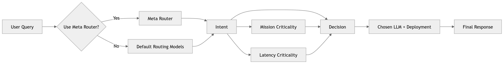

This workflow contains 5 nodes, which are meta router node, intent classification node, mission criticality scoring node, latency criticality scoring node, and decision making node. The roles for each node are as follows:
* **Meta Router**: Select the LLM to generate the answer in the following node.
* **Intent**: The intent classification node that classifies the intent of the user query. We design 5 intentions, as follows:
  1. Simple factual
  2. Explanation
  3. Analysis
  4. Reasoning
  5. Coding
* **Mission Criticality**: providing a score from the mission criticality aspect of the user query.
* **Latency Criticality**: providing a score from the latency criticality aspect of the user query.
* **Decision**: making final LLM selections and deployment decision.

In this workflow, we make the meta router pluggable; the meta router node will be skipped when the user disables it. The remaining nodes will use a default LLM to generate the answer.

Also, we design a skip path after the intent classification node. If the intent node classifies the query as simple factual with high confidence, the router will directly select the small-tier model and select the edge deployment.

After the decision node makes model and deployment selections, we will have a validation to check if the model and deployment selection is valid. For example, if the decision node selects a model that cannot be deployed on the edge but chooses the edge deployment, the custom router will force the deployment to cloud. Similarly, if the decision node selects a small model deployed on cloud, the router will force the deployment back to edge.

Every node has a fallback mechanism to ensure the node can still provide a valid result, but the result will state that the execution of the node has failed.


## Prompt design
#### Meta Router
```text
Pick the LLM for each routing stage. Do not answer the query. Do not pick the final serving model.

Roles:
- intent: classify query type (5 categories)
- mission: score correctness-criticality
- latency: score time-sensitivity
- decision: pick the final (model, deployment)

Available routing models:
{available_models}

Cheapest set that routes reliably:
- Simple/unambiguous → cheapest for all 4.
- Ambiguous / technical / deceptively-simple → upgrade intent and decision.
- mission and latency rarely need a strong model.

Keep `reasoning` ≤ 25 words.

Respond with JSON only, no markdown fences:
{{"intent_model": "<key>", "mission_model": "<key>", "latency_model": "<key>", "decision_model": "<key>", "reasoning": "Brief."}}
```

#### Intent Node
```text
Classify the user query for routing. Do not answer.

- simple_factual: 1-2 sentence fact recall. NOT a short query that needs logic.
- explanation: teach / compare / summarize / synthesize.
- analysis: design, architecture, trade-offs, multi-constraint problems.
- reasoning: logic, math, proofs, step-by-step, trick questions.
- coding: generate / debug / refactor code, SQL, algorithms.

Trap pattern — short numeric or word-puzzle queries that look like simple_factual but hinge on careful reading or multi-step inference:
- "A bat and a ball cost $1.10; the bat costs $1 more than the ball. How much is the ball?" → reasoning (the naive answer 10¢ is wrong).
- "If a clock takes 6 seconds to strike 4, how long does it take to strike 10?" → reasoning (strike intervals, not a fact).
General rule: if the answer depends on parsing the sentence or chaining steps rather than recalling a fact, classify as reasoning, no matter how short the query is. Especially watch for "how many/long/much" phrased as a lookup but loaded with a linguistic twist or counter-intuitive ratio.

Pick one dominant intent by cognitive work, not topic.
Confidence: 0.9+ clear · 0.7-0.9 mild overlap · <0.7 ambiguous.
Keep `reasoning` ≤ 25 words.

Respond with JSON only, no markdown fences:
{"intent": "reasoning", "confidence": 0.78, "reasoning": "Brief."}

`intent` ∈ {simple_factual, explanation, analysis, reasoning, coding}.
```

#### Mission-Criticality
```text
Score how critical correctness is for the query. Do not answer.
Input: query + predicted intent.

Score 0.0-1.0 = consequence of being wrong (not difficulty):
- 0.0-0.2 trivial / casual / easily reversible
- 0.2-0.4 routine; limited consequence
- 0.4-0.6 non-trivial; correctness matters
- 0.6-0.8 production / decision-impacting
- 0.8-1.0 safety / medical / legal / compliance / high-impact financial

Technical ≠ high mission. Creative/exploratory usually low.
Confidence: 0.9+ certain · 0.7-0.9 mostly · <0.7 uncertain.
Keep `reasoning` ≤ 25 words.

Respond with JSON only, no markdown fences:
{"score": 0.45, "confidence": 0.80, "reasoning": "Brief."}
```

#### Latency-Criticality
```text
Score how time-sensitive the query is. Do not answer.
Input: query + predicted intent.

Score 0.0-1.0 = expected response speed (not difficulty):
- 0.0-0.2 deep research / design / essays
- 0.2-0.4 thorough explanation, summary
- 0.4-0.6 general help; balanced
- 0.6-0.8 quick lookup, troubleshooting
- 0.8-1.0 real-time / interactive chat

Rules:
- Simple ≠ urgent. Important ≠ slow-tolerant. Don't infer urgency without wording cues.
- Task-internal latency vs response-latency: latency numbers mentioned INSIDE the task description (e.g. "design a system with sub-100ms latency", "optimize for <10ms database queries") refer to the SYSTEM the user is asking about, NOT the user's expected response time. A design question with strict latency requirements is usually low response-latency — the user wants a thorough answer, not a fast one. Do not conflate.

Confidence: 0.9+ certain · 0.7-0.9 mostly · <0.7 uncertain.
Keep `reasoning` ≤ 25 words.

Respond with JSON only, no markdown fences:
{"score": 0.70, "confidence": 0.85, "reasoning": "Brief."}
```

#### Decision Node
```text
Pick (model_key, deployment) for the query. Do not answer.
Input: query, intent, mission score, latency score.

Deployment: edge = {edge_latency_multiplier}x latency, small-tier only. cloud = {cloud_latency_multiplier}x, any model.

Edge models:
{edge_models}

Cloud models:
{cloud_models}

Capability: many catalog entries carry a parameter count in their display name (e.g. key `llama-3.3-70b` has display "Llama 3.3 70B"); Gemma 3N E4B's (`gemma-3n-e4b`) "E4B" is ~4B *activated* params per forward pass out of a larger total, so it runs at 4B-class cost and speed while a newer architecture gives it stronger quality than `gemma-3-4b` on all tasks. Within a family more params → higher quality, cost, latency; across families, architecture matters more than raw size. Tiers (SMALL/MEDIUM/LARGE) overlap — not a strict order. REASONING specialists excel at math, logic, and multi-step coding/planning. Escalate only when the query justifies it.

The `model_key` you emit MUST be the exact lowercase catalog key from the lists above, not the display name and not an abbreviated form like `gemma-3b`.

Score meanings (both on 0.0-1.0):
- mission_score = consequence of being wrong.
  ≤ 0.35 trivial / casual / reversible · 0.36-0.60 moderate; correctness matters · ≥ 0.61 production, decision-impacting, or safety/legal/medical.
- latency_score = how much the user wants a fast response.
  ≤ 0.35 willing to wait for a thorough answer · 0.36-0.60 balanced · ≥ 0.61 wants a quick reply, values speed over depth.
Treat ≥ 0.60 as "high" and < 0.60 as "low" when applying the quadrant below.

Quadrant (mission × latency):
- high + low → strong cloud (large / reasoning)
- high + high → balanced medium cloud
- low + low → cheapest small edge
- low + high → small edge

Intent nudge: simple_factual → small edge · analysis → large · reasoning → reasoning-tier · coding → large/reasoning if non-trivial.

Cheapest adequate route. Never edge for non-small. Conflict priority: mission > latency > cost.
Confidence: 0.9+ certain · 0.7-0.9 mostly · <0.7 uncertain.

Self-consistency check before emitting JSON:
- Read `model tier=<tier>` of the chosen candidate from the list above. Your reasoning must match that tier. Do not call a `small` model `medium`, or a `medium` model `large`.
- If your reasoning argues for "cloud" or for a medium/large/reasoning-tier model, `deployment` MUST be "cloud".
- If your reasoning argues for a small / edge model, `deployment` MUST be "edge".

Keep `reasoning` ≤ 25 words.

Respond with JSON only, no markdown fences:
{{"model_key": "<model_key>", "deployment": "edge", "confidence": 0.85, "reasoning": "Brief."}}
```

## Experiments
**Caution**: Due to the unavailability of `trinity-mini` on OpenRouter, we use `gemma-3-27b` as the quality evaluator. However, `gemma-3-27b` does not support tool calls, which makes the benchmarking in `src/` fail to use the `output_type` argument when creating an agent. Therefore, we copy the `benchmarking` to `solution` and parse the output json manually instead of using the `output_type` in Pydantic-AI.

We conduct experiments on 11 different routers, including 5 baseline routers: a random router and 4 static routers using one small, one medium, and two large models. The router settings are as follows:

* **Random**: Randomly selects an LLM for each query, with a 50\% probability of deploying the selected LLM on the edge.
* **Static (gemma-3-4b)**: Uses gemma-3-4b for all queries (small LLM).
* **Static (gemma-3n-e4b@edge)**: Uses gemma-3n-e4b@edge for all queries (small LLM).
* **Static (gemma-3-12b)**: Uses gemma-3-12b for all queries (medium LLM).
* **Static (gemma-3-27b)**: Uses gemma-3-27b for all queries (large LLM).
* **Static (nemotron-nano)**: Uses nemotron-nano for all queries (30B large LLM).
* **FastGraphRouter**: Includes a skip path when the intent node classifies the query as a simple factual query. In this case, it directly selects a small LLM deployed on the edge.
* **GraphRouter**: Executes the complete workflow pipeline.
* **MetaRouter**: Uses a meta-router to select the LLM for each node in the workflow. 

### Overall inference perforamnce
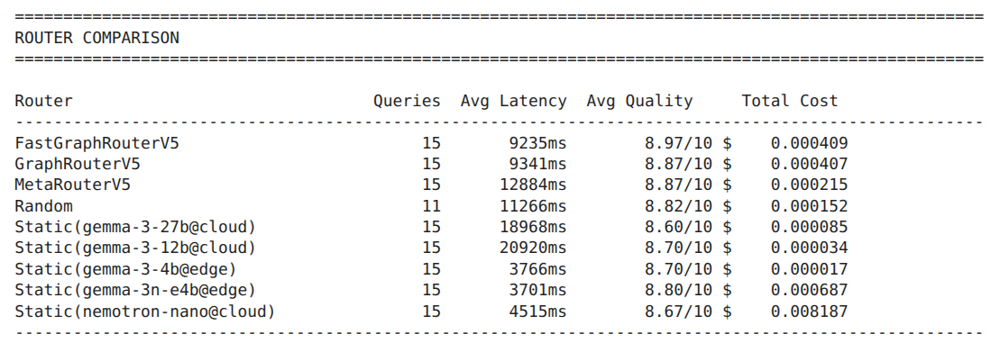
The table shows the overall query-answering performance of the LLMs selected by the routers. We can see that FastGraphRouter achieves the highest quality score compared with the baselines. Although its latency and cost are not the lowest, it still delivers reasonable performance on both metrics, remaining substantially lower than the highest observed latency and cost.

### Quality comparison
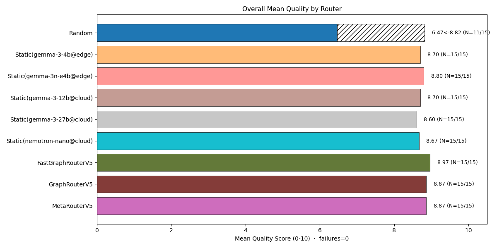
Routers may select LLMs that are not available on OpenRouter, which can lead to an unfair comparison when calculating mean quality. To address this, we penalize unfinished queries by assigning a quality score of 0.

The figure above shows the penalized quality scores across different routing strategies. FastGraphRouter with V5 achieves the highest overall mean quality score, with a score of 8.97. The results also suggest that other custom routing strategies with the V5 prompt outperform the static baselines, indicating that adaptive routing can improve response quality. However, the performance gaps are relatively small, so additional data would be needed to determine whether these differences are statistically significant.


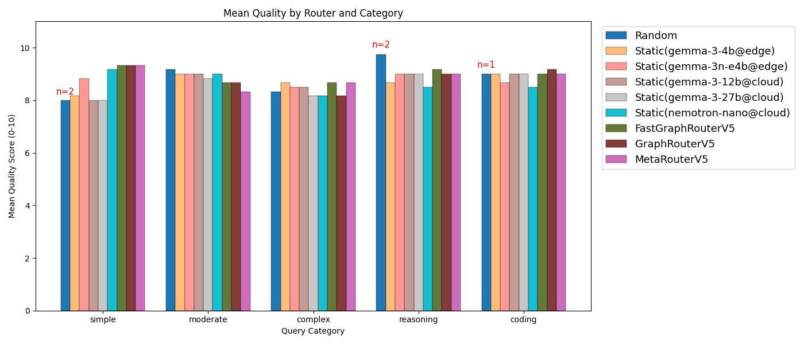
This figure presents the quality scores grouped by query type.

For simple queries, the custom routers achieve higher quality scores than the static baselines. However, for moderate queries, the static baselines perform slightly better than custom routers.

The routers achieve very similar quality scores on coding queries. One possible explanation is that using an LLM-as-a-Judge to evaluate coding responses may be less reliable, because the judge may not be able to fully verify whether the generated code correctly solves the task. A sandbox-based execution environment would provide a more robust evaluation method for coding queries, as it could directly test code correctness against predefined test cases.

An interesting result shows in the complex query category. Static routers with small LLM achieve relatively high quality scores compared with routers that use larger models. This result is unexpected, as larger models are generally assumed to have stronger reasoning and answer-generation capabilities, especially for more difficult queries. However, this observation should be interpreted carefully, since it may be affected by the small number of examples or by variation in the scoring.

Overall, while the results suggest that custom routers can improve quality on certain query types, the differences between routers are generally small. Since each query category contains only three queries, the sample size is too limited to support strong conclusions. Additional data would be needed to determine whether the observed differences are meaningful and consistent.

### Latency comparison

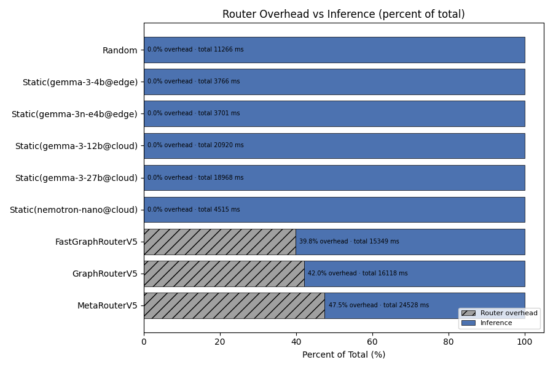
The custom routers introduce substantial latency overhead because they require additional LLM calls during the routing pipeline, such as intent classification, mission-criticality scoring, latency-criticality scoring, and final deployment decision-making. In contrast, the static baselines incur no routing overhead because they send each query directly to a fixed model.

Overall, the static edge baselines have the lowest total latency when the router selects a small LLM deployed on the edge, whereas static cloud models have much higher inference latency. Among the custom routers, FastGraphRouterV5 achieves the lowest total latency because it makes a direct decision when the intent node classifies the query type as simple factual. This reduces the overhead of the scoring and decision nodes.

Routing overhead accounts for a moderate portion of the total latency in adaptive routers. For GraphRouter and MetaRouter, the overhead contributes 42\% and 47.5\% of total latency, respectively. MetaRouter has higher overhead because it includes an additional meta-routing step and may use larger LLMs in later routing nodes.

FastGraphRouter reduces this cost through its skip path, which allows simple factual queries to bypass part of the routing pipeline and directly select a small edge-deployed model. The routing overhead contributes about 39.8\% of the total latency. A similar mechanism in MetaRouter also helps limit the routing-overhead ratio compared with the full routing process.

Overall, the results show that adaptive routing strategies provide greater decision flexibility, but this benefit comes at the cost of increased routing latency.

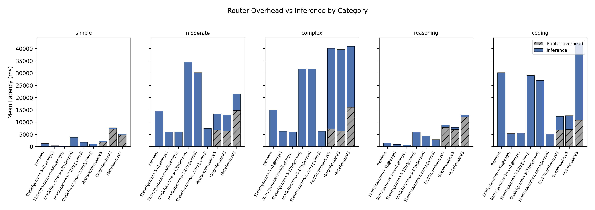
When we analyze routing overhead by query type, we observe that for simple and reasoning queries, routing overhead accounts for a larger share of total latency than it does for moderate and complex queries. This is because, for simple and reasoning queries, the answering LLM generates fewer tokens, which leads to lower inference latency, while the routing overhead does not decrease significantly.

By contrast, for moderate, complex, and coding queries, the proportion of total latency attributable to routing overhead decreases.

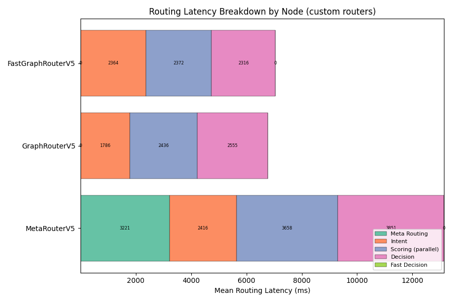
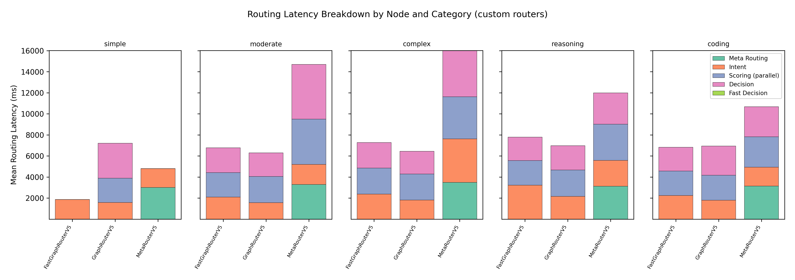
These figures provide a breakdown of routing latency by node and clearly illustrate the contribution of each component to the overall routing overhead. Intent classification is usually one of the smaller components, while the scoring and decision nodes contribute more to the routing overhead.

In addition, the meta-routing node introduces considerable latency in MetaRouter, further increasing the overall routing cost. As a result, MetaRouter generally has higher routing overhead than FastGraphRouter and GraphRouter.

### Cost comparison
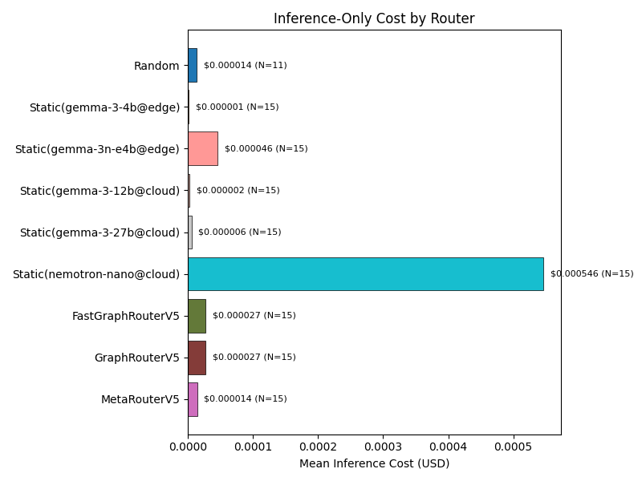

From this figure, we can notice that `gemma-3n-e4b` is a small LLM deployed on the edge, but it has a higher inference cost than some medium-tier cloud-deployed models. At the same time, the earlier quality comparison shows that its quality score is comparable to those medium-tier models. This suggests that `gemma-3n-e4b` may generate more output tokens when answering queries.

The inference cost of the LLM model selected by the custom routers is generally lower than the cost of using `gemma-3n-e4b` and `nemotron-nano`. This indicates that adaptive routing can help reduce inference cost by selecting cheaper models when appropriate.

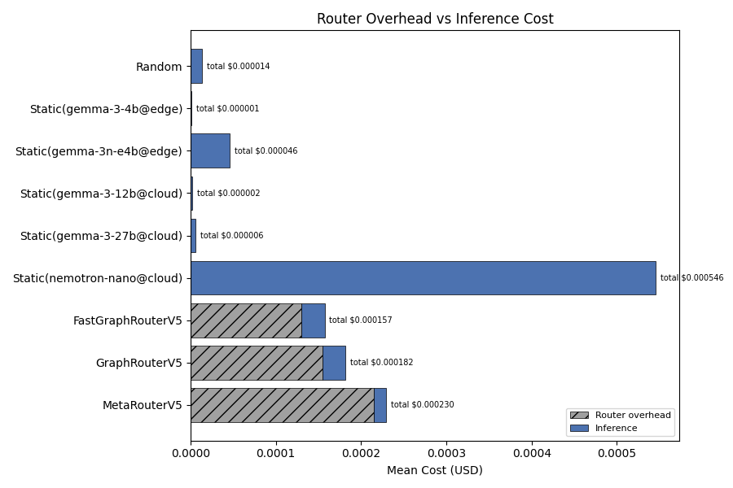
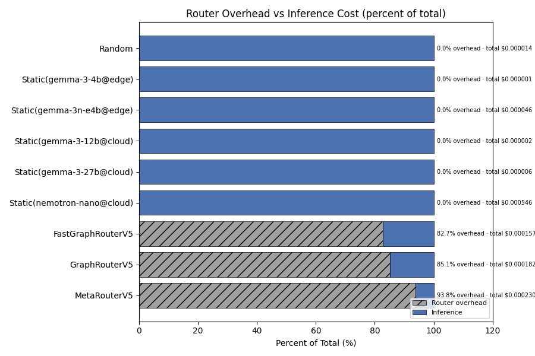
These two figures clearly show that the total cost of custom routers becomes higher than most static baselines. The routing pipeline accounts for more than 80\% of the total cost required to answer a query. This indicates that the cost is dominated not by final inference, but by the additional LLM calls used inside the routing pipeline.

One possible reason is that the router uses `gemma-3n-e4b` as the default LLM in the router. Although this is a small edge-deployed model, the earlier inference-cost results show that it can still be more expensive than some medium-tier cloud models. Since the router calls this model multiple times for intent classification, scoring, and decision-making, this makes the routing cost substantial.

Comparing across custom routers, FastGraphRouter generally has lower total cost than GraphRouter and MetaRouter. This is because FastGraphRouter can use its fast decision path to skip part of the routing pipeline for simple factual queries. In contrast, MetaRouter tends to be more expensive because it includes an additional meta-routing step.

Overall, adaptive routing can reduce inference cost by selecting cheaper models for final answering, but the routing pipeline itself introduces a large additional cost.

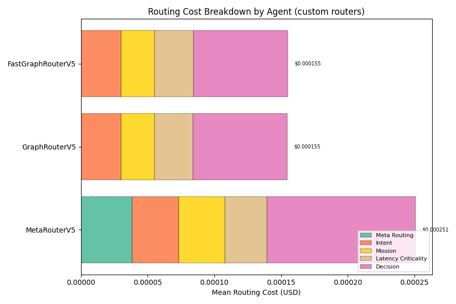
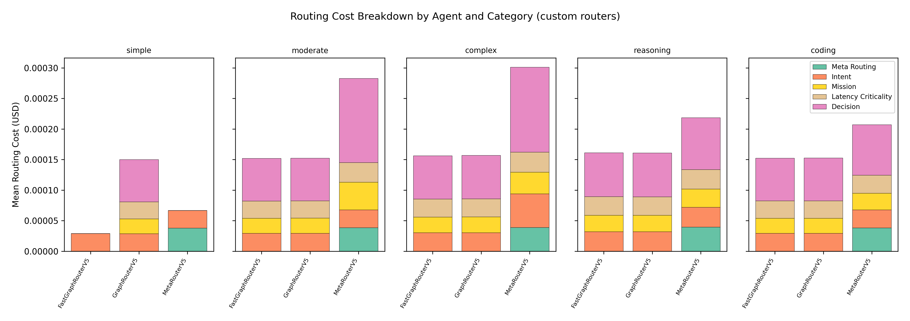
These two figures show the detailed cost breakdown of each node in the custom routing pipeline. Overall, the decision node contributes the largest share of routing cost compared with the other nodes. This is likely because the decision node needs to combine information from intent classification, mission-criticality scoring, and latency-criticality scoring, and then generate reasoning for the selected LLM and deployment. As a result, it consumes more input and output tokens than the other routing nodes.

Across query categories, the routing cost generally increases as query complexity increases. More complex queries require more reasoning during model selection, which leads to higher token usage and higher routing cost.

For FastGraphRouter, the fast decision path helps reduce routing cost for simple queries. When a query is identified as simple factual, the router can skip the scoring and decision nodes, so the overhead only comes from the intent node. This significantly reduces the cost compared with running the full routing pipeline.

### Routing Decision
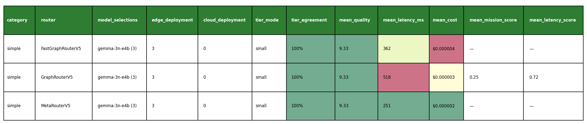
For simple queries, all custom routers select small edge-deployed models. This indicates that the routers can successfully identify simple factual queries and route them to lightweight models for efficient execution. The simple queries receive higher latency-criticality scores than mission-criticality scores in the GraphRouter. The mission-criticality score is 0.25, while the latency-criticality score is 0.72. This suggests that the router considers simple queries as less mission-critical but more latency-sensitive. This makes the routers prefer the selection of smaller edge-deployed models. Overall, the results show that the routing logic behaves as expected for simple factual queries by prioritizing efficiency without relying on larger cloud-based models.

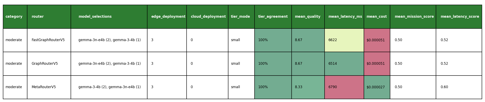
For moderate queries, the intent node classifies the query as a non-simple-factual, and therefore the fast decision path in FastGraphRouter is not activated. This suggests that the intent node is functioning as intended.

The mission-criticality score for the moderate queries is 0.5 and the latency-criticality score ranges from 0.52 to 0.60. For moderate queries, the latency-criticality score is slightly larger than the mission-criticality score and therefore, the decision node tends to select a small LLM on the edge.

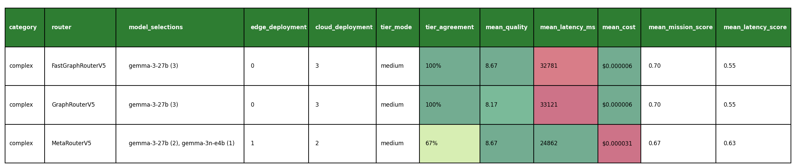
For most complex queries, the custom routers select a medium-tier LLM. Since larger and reasoning-specialized LLMs are currently unavailable on OpenRouter, these medium-tier models represent the most capable available options for complex queries. The mission-criticality scores for complex queries are higher than those for moderate queries, ranging from 0.67 to 0.70. The latency scores range from approximately 0.55 to 0.63. This suggests that complex queries are treated as relatively mission-critical, so the routers usually prioritize model capability and select medium-tier cloud models.

However, small edge-deployed models are still selected in MetaRouter.
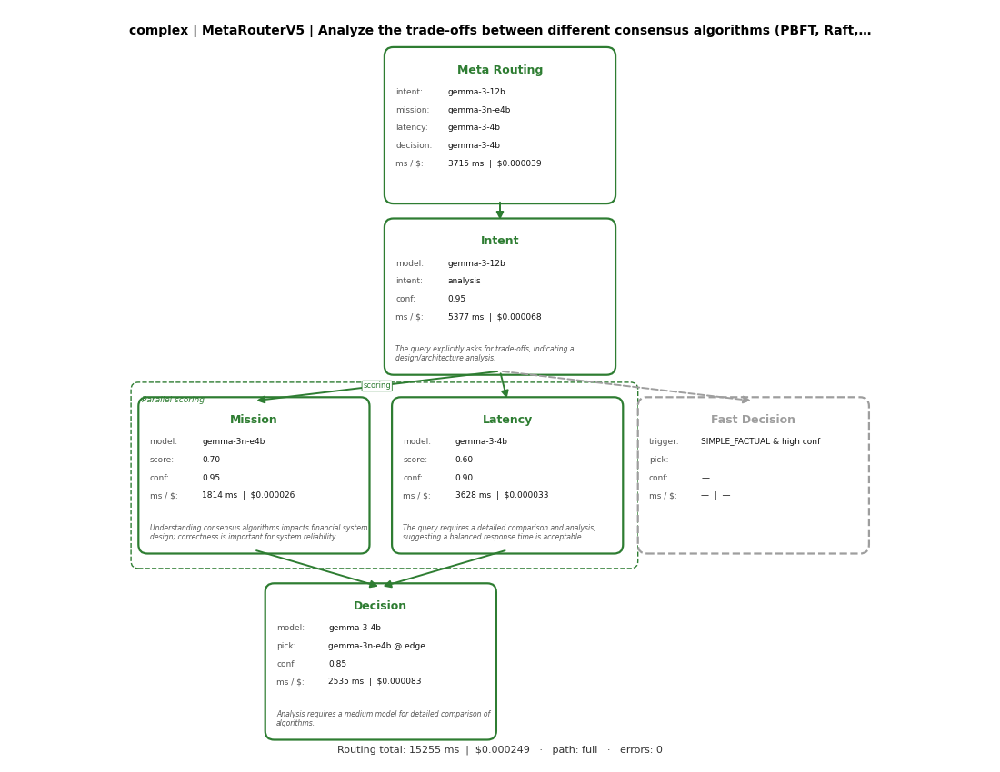
This trace figure shows that the mission-criticality score is higher than the latency-criticality score. However, the LLM used in the decision node is `gemma-3-4b`, which is less powerful than the others and may lead to an incorrect decision.

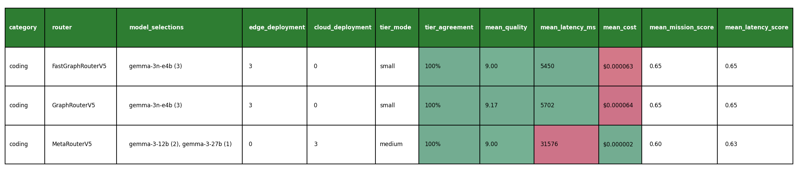
For coding queries, the routers generally tend to select small edge-deployed LLMs, except for MetaRouterV5, which selects medium cloud-based models. For FastGraphRouter and GraphRouter, the mission-criticality score and the latency-criticality score are tight (both are 0.65). In this situation, the prompt tends to select a medium-tier LLM, but `gemma-3n-e4B` tends to select a small LLM on the edge. While for MetaRouter, the decision node is run with `gemma-3-4b`, which makes the coherent decision by selecting the medium tier model on the cloud when the mission-criticality and latency-criticality are high and tight.


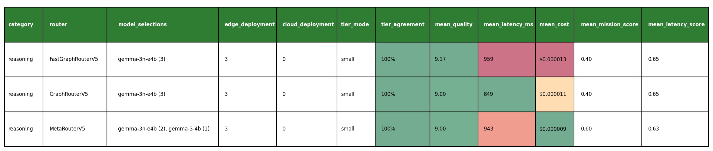
For reasoning queries, most routers tend to select small edge-deployed models. The mission-criticality scores are generally low to moderate, ranging from approximately 0.4 to 0.60. The latency scores range from approximately 0.63 to 0.65. This shows that the routing decision is strongly influenced by the mission-criticality and latency scoring nodes. Since reasoning queries are not classified as highly mission-critical, the routers tend to select efficient edge deployment. In addition, reasoning models are not included in the final selection because they are currently unavailable on OpenRouter. This prevents the router from choosing reasoning models for these reasoning tasks.

### Pipeline Coherence
In this section, we show some of the traces to evaluate the pipeline.

#### Simple query
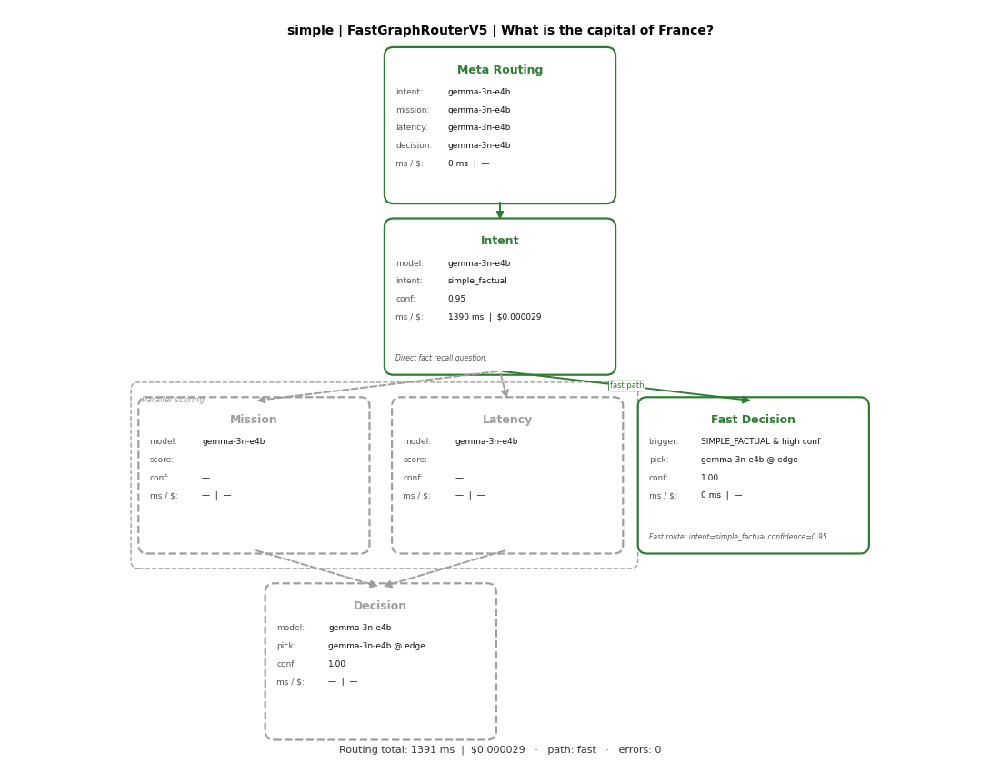
This trace shows that the intent node classifies the query as a direct fact, and then directly makes the decision with the fast decision node.

#### Moderate query
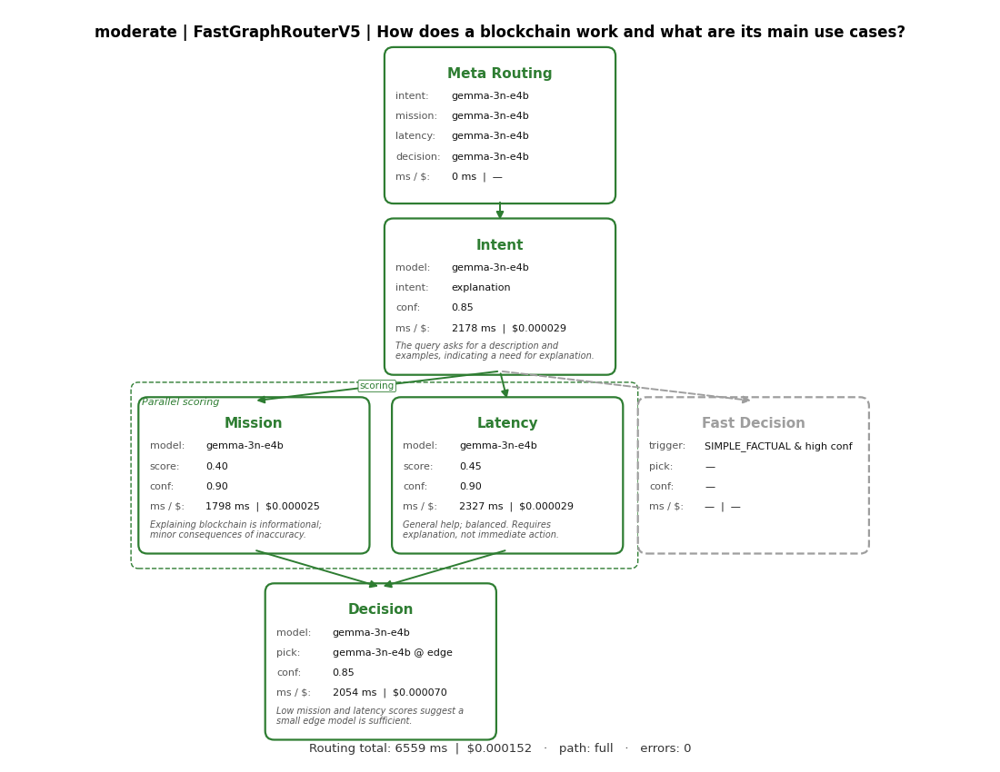
For the moderate query, the intent node classifies it as an explanation topic. The mission-criticality node and latency-criticality node both give a low score on this query. Therefore, the decision node selects a small model on the edge to answer this query.

#### Complex query
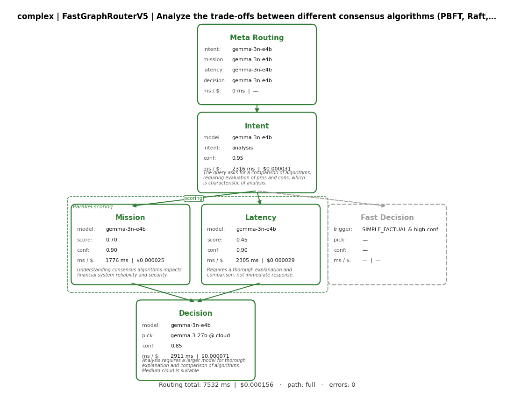
For the complex query, the intent node classifies it as analysis. The mission-criticality node gives a high score while the latency-criticality node gives a low score. Therefore, the decision node selects a medium cloud model to provide a thorough answer for this query.

#### Reasoning query
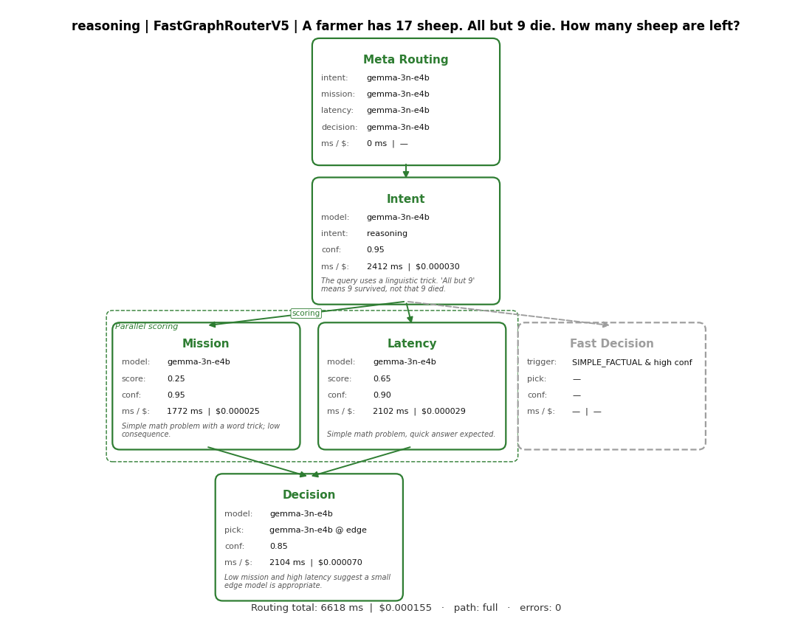
For the reasoning query, the intent node classifies it as reasoning. The mission-criticality node gives a low score while the latency-criticality node gives a high score. Therefore, the decision node selects a small model on the edge to answer this query.

#### Coding query
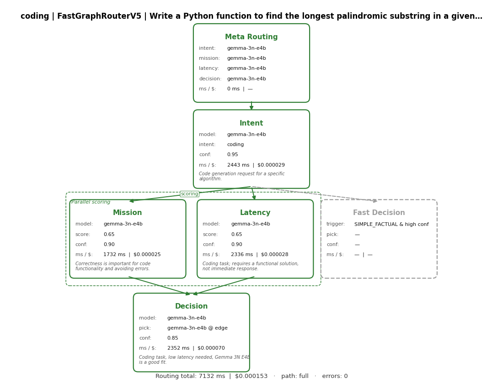
For the coding query, the intent node classifies it as coding. The mission-criticality node and latency-criticality node both give a moderate score (0.65) on this query. The decision node weighs more on the latency score and considers latency as a more important factor. Thus, the decision node selects a small model on the edge to answer this query.

### Limitation
Although FastGraphRouter outperforms the baseline static routers, the current approach has several known limitations. First, due to restrictions in the problem setup, we cannot profile the performance and latency of the registered LLMs or train a classifier for query intent classification, or a regressor to estimate the latency and quality of a specific LLM on a given query. This limits the information available about the registered LLMs. As a result, the decision node does not have access to the estimated quality and latency of each LLM, and only knows the model size, deployment, and cost. This can make model selection difficult, especially when choosing between models within the same tier. Second, the performance of the router depends heavily on the LLM used in each node. For example, the LLM used for scoring can strongly affect the correctness of the assigned scores, yet these scores have no ground truth, so their accuracy cannot be directly evaluated. The LLM used in the decision node can also miscalibrate the scores and make poor selections on more difficult queries. Finally, the evaluation dataset is small, so it is difficult to draw strong conclusions from such a limited set of queries.


# Appendix

The following experiment results are obtained during the design of the prompt.

We design 5 versions of the prompt.
* V1: The original verbose baseline with long explanations, per-factor checklists (harm potential, decision impact, precision, reversibility, context), full per-category example queries, and stacked behavioral disclaimers.
* V2: A moderate rewrite that tightens the text and shortens per-category example lists while retaining the factor checklists and paragraph-heavy guidance. About 50\% the length of V1.
* V3: A structural reformat that replaces prose with bullet points for categories and score bands, and compresses the confidence explanation. About 30\% the length of V1.
* V4: An aggressively compressed prompt that reduces each category to a single-line definition and compresses the confidence into one line. About 20\% the length of V1.
* V5: The V4 base plus three targeted failure-mode fixes derived from V1-V4 trace analysis. For the intent node, include trap-pattern examples for deceptively simple reasoning queries. For the latency node, clarify task-internal and response-latency disambiguation. For the decision node, add basic capability knowledge about the LLMs. Restrict the number of words to 25 on the reasoning output. About 25\% the length of V1.

### Quality comparison
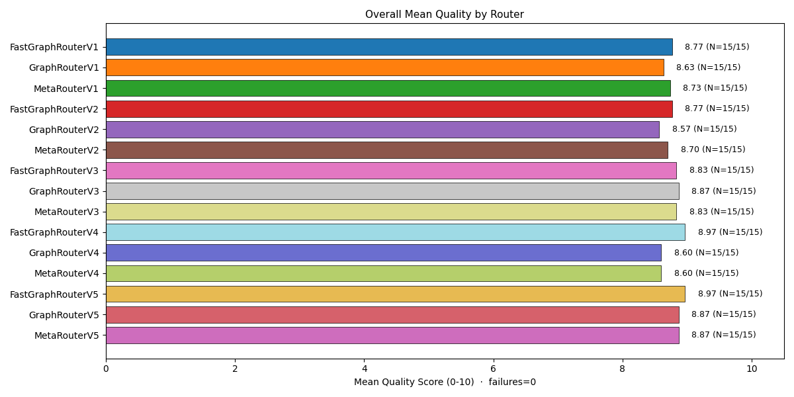
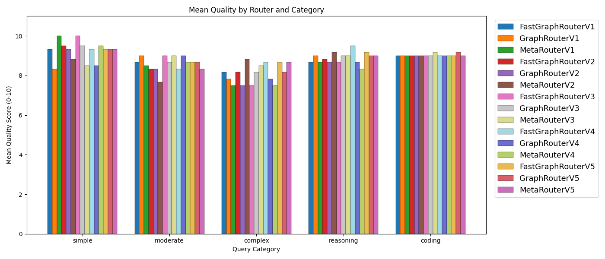
### Latency comparison
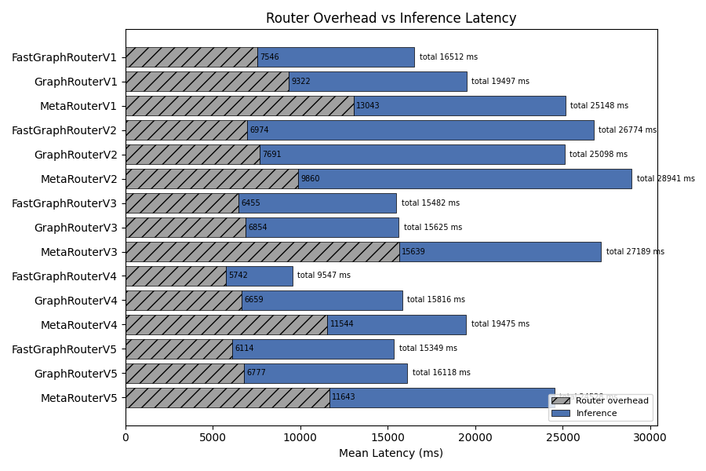
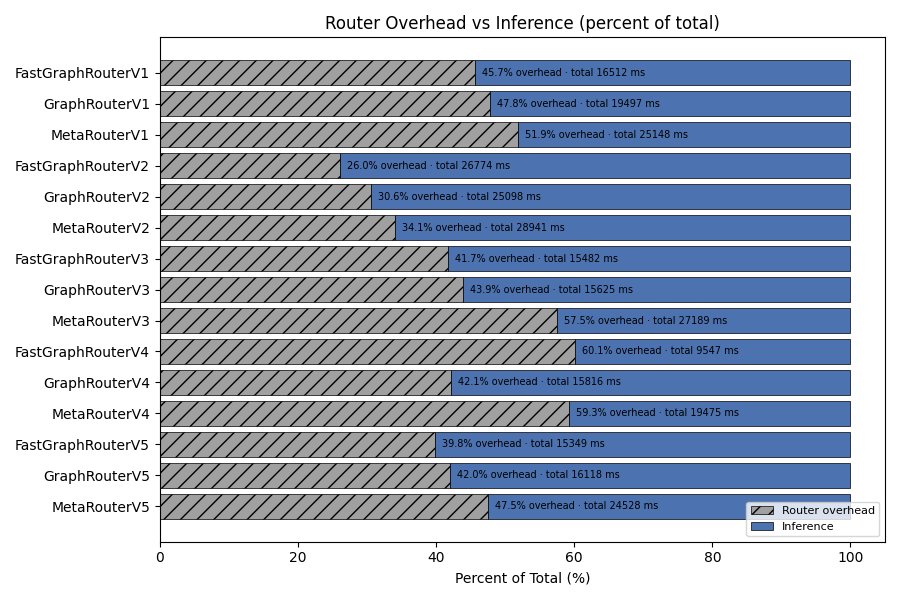
Reducing the prompt length from V1 to V4 appears to decrease routing overhead for FastGraphRouter and GraphRouter. However, this trend is not consistent for MetaRouter, where the overhead varies across prompt versions.


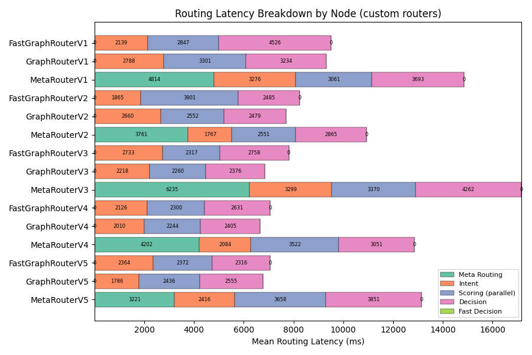
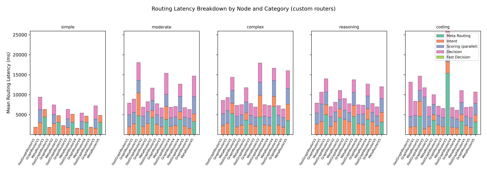
The meta-routing node introduces considerable latency in MetaRouter, further increasing the overall routing cost. This is especially visible in MetaRouterV1, MetaRouterV3, and MetaRouterV4, where meta-routing accounts for a significant share of the total routing latency. As a result, MetaRouter generally has higher routing overhead than FastGraphRouter and GraphRouter.

### Cost comparison
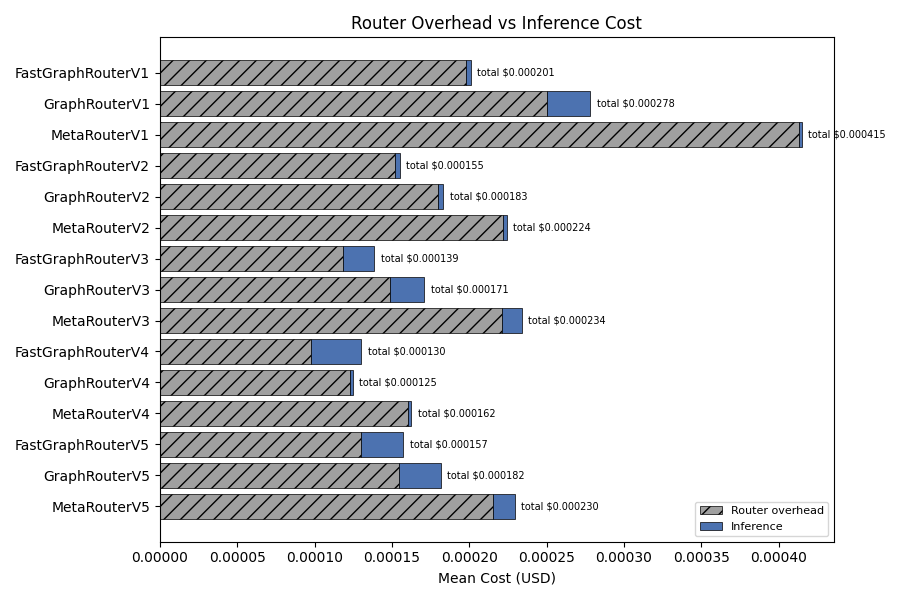
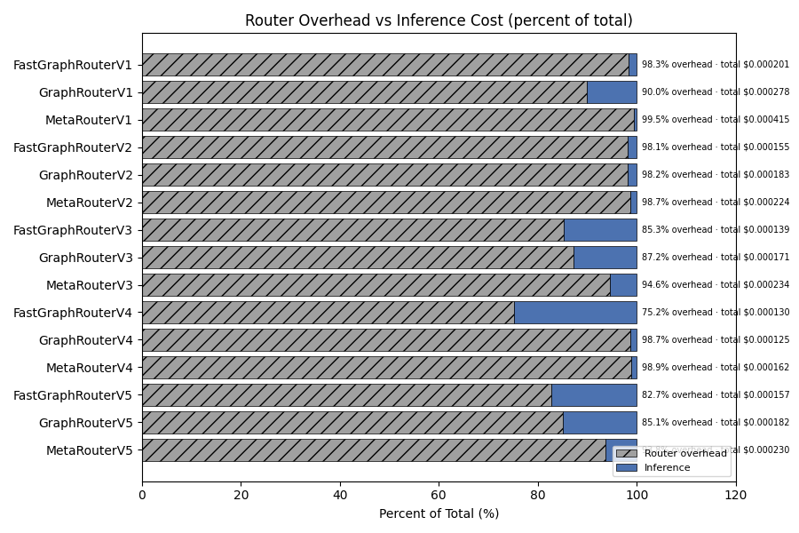
These two figures clearly show that the total cost of custom routers becomes higher than most static baselines. For many custom routers, the routing pipeline accounts for more than 75\% of the total cost required to answer a query. This indicates that the cost is dominated not by final inference, but by the additional LLM calls used inside the routing pipeline.

One possible reason is that the router uses `gemma-3n-e4b` as the default LLM in the router. Although this is a small edge-deployed model, the earlier inference-cost results show that it can still be more expensive than some medium-tier cloud models. Since the router calls this model multiple times for intent classification, scoring, and decision-making, this makes the routing cost substantial.


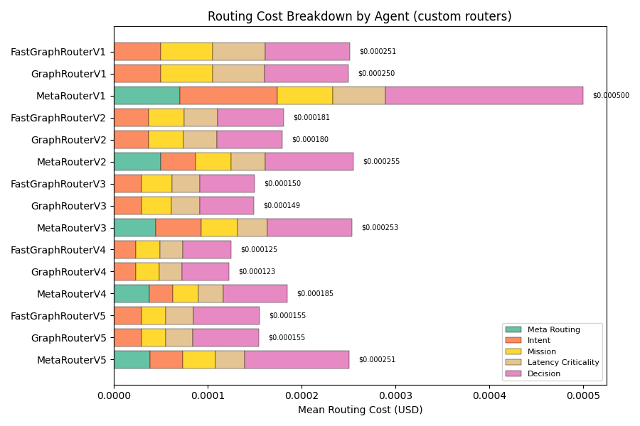
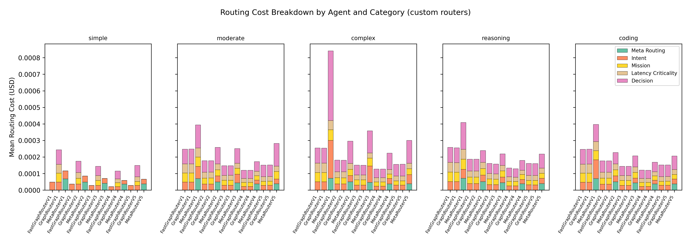


